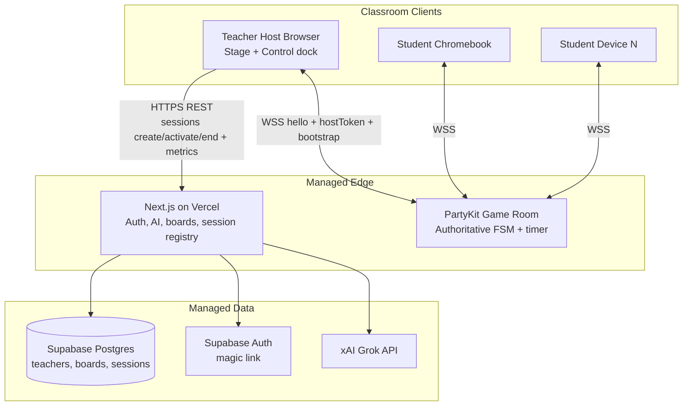
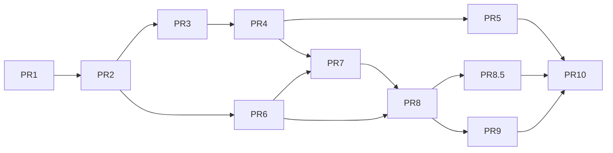

# Design Doc: Teach4Texas Classroom Game Generator (Live Game Show MVP)

| Field | Value |
|-------|--------|
| **Title** | Live Classroom Game Show — Technical Design |
| **Author** | TBD |
| **Date** | 2026-08-02 |
| **Status** | Draft (Rev 4 — TPT access-code monetization; product priority = Game Show first) |
| **Product** | Teach4Texas **live runtime for TPT-sold games** (access codes per game product) |
| **Scope** | Live classroom only; Jeopardy-style board; AI for product creation; TPT access-code gate |

---

## Overview

Teach4Texas’s bestsellers are student-facing games—especially the STAAR Game Show (Jeopardy-style PPTX) and Grammar Galaxy escape rooms. Today those products ship as static Google Slides / PowerPoint downloads sold on TPT. Teachers love the format but cannot generate a custom TEKS-aligned board in minutes, host a live multiplayer session on Chromebooks, or get automatic scoring and a leaderboard without manual bookkeeping.

This document designs a **web app vertical slice** aligned with how Teach4Texas already sells: **each game is a TPT product with its own access codes**. Internal (or operator) tooling AI-generates / edits a game-show board → product ships on TPT with **access code(s)** in the download → teacher redeems an access code on the web app to unlock that board → starts a live room with a short **student join code** → projects a safe host **stage** while controlling from a dock → students join with display name only → teacher paces open / lock / reveal / score → leaderboard.

**Monetization (user decision, Rev 4):** not free SaaS and not a generic subscription for unlimited AI. **Games are sold individually on Teachers Pay Teachers; each game has access codes that unlock live play.** Self-paced modes, offline export, and escape rooms remain out of MVP.

The design reuses the proven content shape from `tpt-products/.../08-staar-review-game-show/` (`category`, `points`, `question`, `answer`, `teks`, `daily_double`), the xAI/Grok pipeline patterns from `generators/lesson_content_generator.py` and `build_game_show.py`, and brand tokens from `generators/brand.py`, while introducing new realtime multiplayer infrastructure that does **not** exist in the repo today and must not break the Astro content site or TPT build pipelines.

**Track 1 quality compromise (explicit):** QUALITY-PLAN Track 1 also stresses visual richness (1+ image per slide). MVP ships **mechanic + themed chrome first**; per-cell AI art is post-MVP. Thematic title, brand colors, confetti leaderboard, and real board navigation still clear the “not a sterile quiz” bar.

---

## Background & Motivation

### Current state

| Asset | Path / notes | Role today |
|-------|----------------|------------|
| Game show questions | `tpt-products/Uploaded to Teachers Pay Teachers/seasonal/08-staar-review-game-show/grade{3,4,5}_questions.json` | 50 questions, 10 categories × 5 point values (100–500), 2 daily doubles; **no MC `choices`** |
| Content narrative | `.../content.md` | Board structure, reveal UX, final round |
| PPTX builders | `build_game_show.py`, `build_pptx.py` | Static interactive deck for TPT |
| AI lesson generator | `generators/lesson_content_generator.py` | Grok via `OpenAI(base_url="https://api.x.ai/v1")`, model `grok-4.3`, structured JSON, `max_tokens=6000` |
| Game show builder | `build_game_show.py` | Models include `grok-4-0709`, image models; QUESTION_SCHEMA for free-response cells |
| Brand colors | `generators/brand.py` | Navy `#1B365D`, burnt `#BF5700`, green `#548235`, gold `#BF8700` |
| Content site | `site/` (Astro + Tailwind) | SEO blog / marketing — **not** a realtime app |
| Root package | root `package.json` + top-level `src/` | Also Astro-oriented; **not** a JS workspace monorepo today |
| Live multiplayer | **None** | No WebSockets, rooms, or student join flow |

### Pain points

1. **One-size boards**: Teachers buy fixed grade bundles; they cannot spin up “tomorrow’s TEKS only” in 5 minutes.
2. **Projector-only interactivity**: PPTX hyperlinks work for reveal, but students do not answer on devices; scoring is paper/mental.
3. **Recurring revenue gap**: TPT is unit sales. MASTER-PLAN.md stream #3 is Micro-SaaS, but **named candidates are QuickSub and AccomTrack** (decision still pending wife’s input)—not a live game. This design proposes live Game Show as an **alternate/additional** Micro-SaaS SKU grounded in bestselling TPT formats (QUALITY-PLAN Track 1), not as the plan’s currently selected SaaS.
4. **Quality bar risk**: QUALITY-PLAN Track 1 requires themed wrapper, real game mechanic, interactive navigation, and treating kids as smart—not a thin quiz wrapper.

### Why now

The content model, TEKS voice, and brand already work. What’s missing is a **session runtime** (rooms, join codes, host controls, answer collection) plus a **web-facing AI generate → edit → play** loop. Designing before building keeps stack and privacy choices intentional. Product prioritization vs QuickSub/AccomTrack remains a business open item (see Open Questions).

---

## Goals & Non-Goals

### Goals (MVP)

1. **Operator** creates game-show boards via AI (grade, subject, TEKS and/or topic) and/or manual editor; marks ready; attaches **TPT product access codes**.
2. Teacher **purchases the game on TPT**, receives access code(s) in the product download, and **redeems** a code on the web app to unlock that board (no paid Stripe wall in-app for MVP).
3. Teacher starts a **live session** with a short **student join code** (distinct from the TPT access code); host UI supports **Stage** (projector-safe) and **Control** (teacher dock) modes.
4. Students join on Chromebooks/tablets: **join code + display name only** (no accounts, no email).
5. Teacher controls pacing: select cell → open question → lock answers → reveal correct answer → optional score override → back to board.
6. End state: **leaderboard / winner** celebration screen.
7. Privacy-minimizing design: no student accounts, short retention, school-network-friendly stack (not a substitute for district compliance).
8. Shippable by a solo indie builder on **managed infra** (minimal ops).

### Non-Goals (MVP)

- **Teacher self-serve game generation** (AI or manual) — hard commercial rule: teachers **buy** games on TPT; they do **not** create free games in-app
- **Public game catalog / free play without a paid access code**
- Self-paced / homework mode
- Offline / downloadable packages or PPTX export (post-MVP bridge to TPT)
- Escape room format
- Team mode (table groups as single score entity)
- Final Jeopardy wager round
- **Legacy free-response JSON import** of `grade*_questions.json` (post-MVP; distractors are hard—see Content gap)
- **`subject: mixed` boards** (defer; single-subject only)
- District SSO / LMS (Google Classroom roster sync)
- Image-heavy AI art generation per cell
- Parent accounts, student progress analytics dashboards, longitudinal data
- Open multiplayer (public rooms searchable by strangers)
- Encrypted durable session snapshots containing student names

---

## Proposed Design

### Recommended stack (and why)

| Layer | Choice | Rationale |
|-------|--------|-----------|
| **Live app framework** | **Next.js 15 (App Router) + React + TypeScript + Tailwind** | Real app needs SSR/API routes, auth cookies, and dynamic UI. Existing Astro site stays static SEO. |
| **Realtime rooms** | **PartyKit** (Cloudflare edge) | Authoritative single-threaded room actor; clean FSM for open/lock/reveal; 40-player fanout without Postgres write races. See **Stack trade-off** below. |
| **Persistence (boards, teachers, session registry)** | **Supabase** (Postgres + Auth) | Magic-link auth; board CRUD; **session registry** rows for codes/tokens (not live game ticks). |
| **AI generation** | **xAI Grok** via OpenAI-compatible client; model pinned by env `XAI_MODEL` (default `grok-4.3` to match `lesson_content_generator.py`) | Consistency with existing TEKS content quality. |
| **Hosting** | App on **Vercel**; PartyKit on **Cloudflare**; Supabase managed | Zero server SSH for MVP. |
| **Python generators** | Remain for **TPT offline pipeline only**; live app reimplements prompts in TypeScript | Avoid coupling SaaS deploy to local `python -m generators.*`. |

**Why not extend Astro?** Poor fit for long-lived WebSocket rooms, teacher auth sessions, and interactive host SPA.

**Why not self-host Redis + Socket.IO?** Ops burden for a solo builder.

#### Stack trade-off: PartyKit vs Supabase-only (final pick)

| Path | When it wins | Cost for solo builder |
|------|----------------|----------------------|
| **PartyKit + Supabase + Vercel (chosen)** | Authoritative in-memory FSM, server alarms for timers, low-latency fanout to ~40 clients, no “last write wins” on concurrent answers | **Three vendors**: three dashboards, deploys, billing, local-dev processes (Next + PartyKit + Supabase CLI) |
| Supabase-only (Realtime Broadcast + `rooms` row + Edge Functions) | One vendor for auth/DB/realtime; fewer moving parts | Harder to make open/lock/reveal **race-free** under concurrent student answers without careful row locking or a single writer; timer auto-lock is awkward (cron/edge schedule vs DO alarm); broadcast is not a true actor |
| Convex / Firebase full stack | Great DX, reactive | Deeper lock-in; less alignment with existing Supabase-friendly teacher auth patterns |
| Ably + Supabase | Battle-tested pub/sub for quiz games | Still multi-vendor; less “room as code unit” than PartyKit |

**Decision: keep PartyKit** because the product’s core value is the live game FSM (timer expiry, idempotent reveal, sanitize-by-role, reconnect). Those are natural Durable Object / Party room behaviors. Supabase Realtime alone would push us toward either optimistic client chaos or a home-grown single-writer service—i.e., reinventing PartyKit.

**Accept multi-vendor risk explicitly** (see Risks). Mitigations: env catalog in PR 1; local-dev runbook (`npm run dev` starts Next + `partykit dev`); preview deploys documented; synthetic health probe for PartyKit.

### Repo layout (non-breaking)

**Current repo reality:** root `package.json` and `site/package.json` are separate Astro apps; there is **no** pnpm/npm workspace today. Adding `apps/live-game` must not assume monorepo tooling exists until we add it.

**Decision: fully independent package first** (`apps/live-game` owns its `package.json`, lockfile optional, own Vercel project). Optional later: root `pnpm-workspace.yaml` if we extract `packages/game-schema`. Do **not** rewrite root Astro into a workspace in the same PR as scaffold.

```text
teach4texas/
  site/                          # EXISTING Astro content site — unchanged
  generators/                    # EXISTING Python TPT pipeline — unchanged
  tpt-products/                  # EXISTING — unchanged
  apps/
    live-game/                   # NEW independent Next.js + PartyKit package
      package.json               # private; scripts: dev, build, party:dev, test
      .env.example               # full env catalog
      README.md                  # local-dev + deploy runbook
      src/
        app/                     # App Router
          page.tsx
          login/
          create/
          boards/
          host/[roomCode]/
          join/
          play/[roomCode]/
          api/
        components/
          BoardGrid.tsx
          HostStage.tsx          # projector-safe
          HostControlDock.tsx    # answer key + controls
          QuestionPanel.tsx
          Scoreboard.tsx
          JoinForm.tsx
        lib/
          supabase/
          party/
          ai/
          domain/                # board, session, scoring, sanitizeForPlayer, FSM
          brand.ts
          protocol.ts            # protocol_version + message types
        middleware.ts            # CSP baseline, auth
      party/
        game-room.ts
      supabase/migrations/
      tests/
        unit/
        integration/             # multi-client harness
```

Rules:

- Do not put game runtime under `site/src` or share the Astro build.
- Marketing deep-links from Astro to `https://play.teach4texas.com` (domain TBD).
- Offline `grade*_questions.json` remains **fixture reference** for tests (with hand-authored MC for a 5×5 sample), not a production import path in MVP.

### High-level architecture



**No server-to-server “create room” REST into PartyKit is required.** Rooms materialize on first WebSocket connection; Next only writes a **session registry** row and returns credentials to the host browser. **PartyKit never calls Supabase in MVP** (no service-role fetch edge). Persistence of registry status and `session_metrics` is **host-mediated via Next** (see Session registry lifecycle).

### Domain model

#### Content objects (durable)

Aligned with offline question JSON **plus** live MC fields. Offline free-response-only JSON is **not** a supported production import in MVP.

```ts
type QuestionCell = {
  id: string;                 // uuid
  category: string;
  points: 100 | 200 | 300 | 400 | 500;
  question: string;
  answer: string;             // canonical reveal text
  teks: string;               // e.g. "3.4A" or "3.4A, 3.4K"
  daily_double: boolean;
  choices: [string, string, string, string];
  correct_index: 0 | 1 | 2 | 3;
  needs_review?: boolean;     // true if content may need teacher pass (AI draft)
};

type BoardStatus = "generating" | "draft" | "ready" | "failed";

type GameBoard = {
  id: string;
  owner_id: string;
  title: string;
  grade: 3 | 4 | 5;
  subject: "math" | "rla" | "science"; // MVP: no "mixed"
  status: BoardStatus;
  last_error_code: string | null; // set when status === 'failed' (e.g. UPSTREAM_TIMEOUT)
  generating_started_at: string | null; // ISO; set when entering generating
  teks: string[];
  topic: string | null;
  categories: string[];       // length === 5 in MVP
  cells: QuestionCell[];      // length === 25 when draft/ready; may be [] while generating/failed
  theme: {
    wrapper_name: string;
    accent: "navy" | "burnt" | "green" | "gold";
  };
  created_at: string;
  updated_at: string;
  deleted_at: string | null;
};
```

**Board status transitions**

| From | To | Trigger |
|------|-----|---------|
| (new) | `generating` | `POST /api/boards/generate` creates row |
| `generating` | `draft` | AI assemble + Zod success; cells `needs_review: true` |
| `generating` | `failed` | Validation/upstream failure after retries; or sweeper |
| `failed` | `generating` | Teacher retries generate on same or new board |
| `draft` | `ready` | Teacher “Mark ready” after edit (invariants pass) |
| `ready` | `draft` | Teacher re-opens for edit (optional) |
| any | soft-deleted | `DELETE` sets `deleted_at` |

**Stuck-`generating` recovery:** sweeper (cron or on `GET /api/boards/[id]`) if `status === 'generating'` and `generating_started_at` older than **3 minutes** → set `status = 'failed'`, `last_error_code = 'UPSTREAM_TIMEOUT'`. Teacher sees failure UI and can open manual editor / load sample / retry.

**Invariants (API Zod + DB check where practical; apply when `status` is `draft` or `ready`):**

- `categories.length === 5`
- `cells.length === 25`
- Per category: exactly one of each points 100..500
- Exactly 2 `daily_double: true` at points ≥ 300
- Each cell has 4 non-empty choices; `correct_index` in 0..3
- **Scoring uses `correct_index` only.** Field `answer` is teacher/student **reveal copy** (display text); soft-check that `choices[correct_index]` is non-empty. Do not fuzzy-match `answer` string for scoring.

**MVP board size:** 5×5 = 25 cells. A full clear is **optimistic** for one period; expect **8–12 cells played** with discussion in a 45-min class (see Classroom UX). Full TPT 10×5 remains post-MVP.

**Scoring mode:** individual students only.

#### Live session objects (ephemeral in PartyKit; registry in Supabase)

```ts
type RoomPhase =
  | "lobby"
  | "board"
  | "question_open"
  | "question_locked"
  | "reveal"
  | "final"
  | "closed";

type Player = {
  id: string;                 // uuid, client-persisted
  resume_secret_hash: string; // hash of secret issued on first join
  display_name: string;       // 2–16 chars, filtered
  score: number;
  connected: boolean;
  joined_at: number;
  connection_id: string | null; // current WS attachment
};

type CellState = {
  cell_id: string;
  status: "available" | "active" | "answered";
  /** Points granted on last successful reveal; empty until scored */
  points_awarded: Record<string, number>; // player_id → points for this cell
  scored: boolean;            // true after first successful reveal (idempotency)
};

type LiveRoom = {
  protocol_version: number;   // e.g. 1
  code: string;
  host_token_hash: string;
  host_connection_id: string | null;
  /** Full GameBoard with answers — host authority only; never broadcast raw to players */
  board_snapshot: GameBoard;
  phase: RoomPhase;
  players: Record<string, Player>;
  cells: Record<string, CellState>;
  active_cell_id: string | null;
  open_until: number | null;  // server epoch ms; set on open_question
  answers: Record<string, {
    choice_index: number;
    submitted_at: number;
  }>;
  reveal_applied: boolean;    // per active question; reset on select/open
  settings: {
    answer_seconds: number;   // default 30
    award_mode: "all_correct"; // only mode in MVP
    max_players: number;      // 40
    lobby_locked: boolean;
  };
  created_at: number;
  expires_at: number;         // created + 4h
};

// Session registry row (Supabase) — durable credentials, not live ticks
type SessionRegistry = {
  code: string;               // PK
  board_id: string;
  owner_id: string;
  host_token_hash: string;
  board_snapshot: jsonb;      // full GameBoard at create (immutable for session)
  status: "pending" | "active" | "ended";
  created_at: timestamptz;
  expires_at: timestamptz;
};
```

**Views of board data:** `LiveRoom.board_snapshot` is always the full `GameBoard`. Host `room_state` may include answers/`correct_index`. Player `room_state` is produced only by `sanitizeForPlayer(liveRoom)` — never send `board_snapshot` raw on the player channel.

#### Scoring rules (MVP)

- **Scoring uses `correct_index` only** (compare submitted `choice_index`). Field `answer` is reveal/display copy only.
- Mode **`all_correct` only**: on successful `host.reveal`, every player whose submitted `choice_index === correct_index` earns:
  - Normal cell: `points`
  - Daily Double: **fixed 2× points** (no mid-class wager in MVP)
- Incorrect or no answer: 0 (no negatives).
- **Idempotent reveal:** if `cells[active].scored === true` or `reveal_applied`, second `host.reveal` **always** returns `{ type: "error", code: "ALREADY_REVEALED", message }` **and** re-sends current reveal `room_state` so host UI can toast without double-scoring.
- **Host override** (after reveal or on board):  
  `host.award_override { player_id, op: "delta" | "set", value: number }`  
  - `delta`: add `value` (may be negative) to `player.score`  
  - `set`: set absolute score  
  Overrides do not rewrite `points_awarded` history unless we log a simple audit event in-memory (optional).
- Do **not** use a single `awarded_to` field (misleading under `all_correct`).

### UI surfaces

| Surface | URL | Audience | Notes |
|---------|-----|----------|-------|
| Landing | `/` | Teachers | Value prop; CTA redeem TPT access code; join for students |
| Redeem | `/redeem` | Teachers | Enter **product access code** from TPT download |
| Host | `/host/[code]` | Teacher | Stage + Control dock (after redeem + start session) |
| Join | `/join` | Students | **Room join code** + name; privacy blurb |
| Play | `/play/[code]` | Students | Portrait-first Chromebook UI |
| Admin create | `/admin/create` | Operator | AI generate / blank + sample |
| Admin edit | `/admin/boards/[id]/edit` | Operator | Edit grid; mark ready; mint access codes |
| Admin practice | `/admin/boards/[id]/practice` | Operator | Single-device, no WS |
| Admin boards | `/admin/boards` | Operator | Inventory + codes |

#### Practice mode (single-device dogfood)

**Contract (PR 4):**

| Item | Spec |
|------|------|
| Route | `/boards/[id]/practice` — owner only (Supabase session + `owner_id`) |
| Eligibility | Board `status` in **`draft` or `ready`** (allows QA while editing; not `generating`/`failed`) |
| Network | **No PartyKit**, no session create, no other players |
| State | Local React state only; mirrors subset of FSM: `board` → select cell → `question_open` (local timer OK) → `reveal` (self) → back to board |
| Scoring | Optional self-score for fun; **not persisted** to Postgres or metrics |
| UI reuse | Same `BoardGrid` + `QuestionPanel` components as live; Control-style answer key always available (teacher alone) |
| Exit | “Back to editor” / “Host live session” (latter requires `ready`) |

#### Host: Stage mode vs Control mode

Classroom risk: projecting answer keys / lock buttons lets students shoulder-surf.

| Mode | Visible content | Default |
|------|-----------------|---------|
| **Stage** | Board grid, room code (large), scores (names + totals), “X of N answered” bar, phase label, timer remaining, **no** correct answer / choices highlight / control tokens | **On load**, optimized for projector / screen-share |
| **Control** | All Stage content + answer key, correct index, Open / Lock / Reveal / Back / End / Kick / Lock lobby / Force board, override scores | Teacher laptop; collapsible dock, **collapsed by default** when `?project=1` |

Implementation: single page `/host/[code]` with CSS layout:

- `HostStage` always full-bleed 16:9 safe region
- `HostControlDock` drawer (right or bottom); `localStorage host_dock_open`; keyboard `C` toggles dock
- Answer text on Stage **only** during `reveal` / `final` (after lock)—never during `question_open`

**Host indicators:** live `answered_count / connected_players` during open; kick list in dock.

**Student idle UI** (lobby / between questions on `board` phase): branded theme title, “Get ready…”, own score, optional rank—not frozen last reveal (clear on `back_to_board`).

**Student layout:** **portrait-first** for Chromebooks (stacked MC buttons full width); host remains 16:9 landscape.

**Fonts:** Stage board cells min 28–32px; question text 40px+; high contrast brand colors.

### Content gap: offline free-response → live MC

Verified offline schema has **no `choices`**. ~1/3 of grade-3 answers are multi-part free response; RLA inference without passages yields poor auto-distractors.

**MVP approach:**

1. AI generation **must emit MC** with grade-plausible distractors; prompt requires TEKS-aware wrong answers (common computation errors for math).
2. All AI cells set `needs_review: true` until teacher saves as `ready`.
3. **No production import** of raw `grade*_questions.json` in MVP.
4. Test fixtures: hand-authored 5×5 math sample (subset of grade3 spirit with real distractors).
5. RLA/science allowed but quality risk higher—teacher edit is the safety net; optional future scope cut to math-only if beta quality fails.

### Live session protocol

- **Party room id** = room code (normalized).
- **Protocol version:** `PROTOCOL_VERSION = 1`. Clients send `protocol_version` on `hello`; server rejects mismatch with `{ type: "error", code: "PROTOCOL_MISMATCH", message, server_version }`.
- Messages: compact JSON over WSS.

#### Event catalog

| Event | Direction | Purpose |
|-------|-----------|---------|
| `hello` | C→S | Host or player attach (see Connection lifecycle) |
| `room_state` | S→C | Role-sanitized snapshot |
| `player_joined` / `player_left` / `player_updated` | S→C | Presence |
| `host.select_cell` | Host→S | Choose cell |
| `host.open_question` | Host→S | Start open + server timer |
| `host.lock` | Host→S | Early lock |
| `host.reveal` | Host→S | Score once + show answer |
| `host.award_override` | Host→S | `{ player_id, op, value }` |
| `host.back_to_board` | Host→S | Phase `board` |
| `host.force_board` | Host→S | Escape hatch from stuck open/locked/reveal |
| `host.start_game` | Host→S | Lobby → board (begin play; optional if first `select_cell` also advances) |
| `host.end_game` | Host→S | Phase `final` |
| `host.kick` | Host→S | `{ player_id }` remove player |
| `host.lock_lobby` | Host→S | Reject new joins |
| `player.answer` | Player→S | `{ choice_index, client_msg_id? }` |
| `answer_accepted` | S→C | Ack to player |
| `answer_count` | S→Host | `{ count, connected }` |
| `timer` | S→C | `{ open_until, server_now }` on open and on request |
| `error` | S→C | `{ code, message }` |

#### Host command FSM

| from_phase | event | to_phase | Notes |
|------------|-------|----------|-------|
| lobby | `host.start_game` | board | Primary path to leave lobby |
| lobby | `host.select_cell` | board | Also advances lobby→board, then sets active cell |
| board | `host.select_cell` | board | sets active; cell must be available |
| board | `host.open_question` | question_open | requires active available cell; sets `open_until` |
| question_open | `host.lock` | question_locked | |
| question_open | *(timer alarm)* | question_locked | server-authoritative |
| question_open | `player.answer` | question_open | if before `open_until` |
| question_locked | `host.reveal` | reveal | applies scores once |
| reveal | `host.back_to_board` | board | clears active answers |
| reveal | `host.award_override` | reveal | |
| board / reveal / final | `host.end_game` | final | from board/reveal enters final; if already final → `ALREADY_ENDED` |
| * (not closed) | `host.force_board` | board | cancels timer; does not score |
| * | illegal event | *(unchanged)* | `error` `ILLEGAL_TRANSITION` |

Duplicate host commands that are no-ops **always** return explicit `{ type: "error", code }` for host toasts: `ALREADY_REVEALED`, `ALREADY_LOCKED`, `ALREADY_ENDED`, plus re-send current `room_state`.

#### Server-authoritative timer

1. On `host.open_question`: `phase = question_open`; `open_until = Date.now() + settings.answer_seconds * 1000`; schedule PartyKit alarm / `setTimeout` in room DO.
2. Clients render countdown from `open_until - server_now` (include `server_now` in payloads to reduce skew). **Do not** trust client clocks for eligibility.
3. On alarm: if still `question_open` → transition to `question_locked`; broadcast.
4. Reject `player.answer` if `phase !== "question_open"` **or** `server_now > open_until` → `error` `ANSWER_WINDOW_CLOSED`.
5. First answer per player wins; subsequent `player.answer` → `error` `ALREADY_ANSWERED` (idempotent if same `client_msg_id` + same choice → ack without change).

#### Connection lifecycle

**Player identity**

- On first successful join, server issues `{ player_id, resume_secret }` (secret = 32 bytes crypto random, only shown once).
- Client stores both in `localStorage` key `t4t_player_${code}`.
- `resume_secret` stored only as **SHA-256 hash** in room state.

**`hello` shapes**

```ts
// Host first attach (room empty) — bootstrap required
{
  type: "hello",
  protocol_version: 1,
  role: "host",
  host_token: string,          // plaintext issued by Next
  bootstrap: {
    code: string,
    board_id: string,
    expires_at: number,        // unix ms
    host_token_hash: string,   // sha256(host_token) hex — MUST match presented token
    content_hash: string,      // sha256(canonical_json(board_snapshot))
    board_snapshot: GameBoard,
    sig: string,               // HMAC over bound fields (see bootstrap)
  }
}

// Host reconnect (room already materialized) — token only
{
  type: "hello",
  protocol_version: 1,
  role: "host",
  host_token: string,
  // bootstrap omitted / ignored
}

// Player join or resume
{
  type: "hello",
  protocol_version: 1,
  role: "player",
  display_name?: string,       // required if new
  player_id?: string,          // if resume
  resume_secret?: string,
}
```

**Rules table (phase × join/resume)**

| Situation | Behavior |
|-----------|----------|
| New player, lobby/board/question_* /reveal | Allowed if capacity & !lobby_locked; create player |
| New player, final/closed | Reject `ROOM_CLOSED` |
| Resume player (valid id+secret), any open phase | Reattach `connection_id`; `connected=true`; send sanitized `room_state`; **keep score** |
| Resume with bad secret | Reject `RESUME_FAILED`; may join as new if name provided (new id) |
| Late join during `question_open` | May **answer** if window still open and not yet answered |
| Late join during `question_locked` / `reveal` | Observe only; no answer; see reveal payload if phase is reveal |
| Double `hello` same connection | Idempotent; re-send `room_state` |
| Player second device with same resume | New connection **steals** attachment; old connection gets `error` `SESSION_TAKEN` then close |
| Host first connect | Verify bootstrap sig + `sha256(host_token)===host_token_hash`; materialize `LiveRoom` |
| Host reconnect | `sha256(host_token) === LiveRoom.host_token_hash` only; reattach |
| Second host connection valid token | **Take over**: previous host gets `error` `HOST_TAKEN` and is demoted to spectator-none (disconnect); new connection becomes host. No co-host in MVP. |
| Host disconnect | Room **stays open** for 4h TTL; students remain; phases freeze until host returns (timer still fires if open) |
| Host never returns | Room expires; students see `ROOM_EXPIRED` |

**Idempotency**

- `player.answer`: first write wins; optional `client_msg_id` for at-least-once WS retry.
- Host phase transitions: FSM rejects illegal; reveal scoring once via `scored` flag; always explicit error codes on no-ops.

#### Room bootstrap (concrete)

**Chosen pattern (MVP only): session registry + host WS bootstrap with HMAC binding `host_token_hash`.**

PartyKit **does not** call Supabase. There is **no JWT fork** and **no service-role board fetch** in MVP.

**Signing algorithm (single definition)**

Canonical string (UTF-8), fields separated by `|`:

```text
v1|{code}|{board_id}|{expires_at}|{host_token_hash}|{content_hash}
```

- `host_token_hash` = lowercase hex SHA-256 of the **plaintext** `hostToken` issued by Next  
- `content_hash` = lowercase hex SHA-256 of **canonical JSON** of `board_snapshot` (stable key order via sorted keys or JSON.stringify of Zod-parsed object)  
- `sig` = lowercase hex **HMAC-SHA256**(`PARTY_BOOTSTRAP_SECRET`, canonical string)

**Create session**

1. Teacher `POST /api/sessions { boardId }`:
   - AuthZ: board `owner_id`, `status === 'ready'`, `deleted_at IS NULL`, 25 valid cells.
   - Generate `code` (collision check against registry where `expires_at > now()` and `status != 'ended'` optional).
   - Generate `hostToken` = **32 bytes** CSPRNG → base64url (~43 chars).
   - Compute `host_token_hash = sha256(hostToken)`.
   - Build `board_snapshot`, `content_hash`, `expires_at` (now+4h), `sig`.
   - Insert `session_registry` with `status: 'pending'`, store hash + snapshot.
   - Return **once**:

```ts
{
  code,
  hostToken,                 // plaintext — only time returned
  partyHost,
  protocol_version: 1,
  bootstrap: {
    code,
    board_id,
    expires_at,
    host_token_hash,
    content_hash,
    board_snapshot,
    sig,
  }
}
```

2. Host page stores `hostToken` in **`sessionStorage`** key `t4t_host_${code}` (not long-lived URL query). Bootstrap object may live in memory/sessionStorage for first connect only.

**First host `hello` verification (PartyKit)**

1. Reject if room already exists → treat as reconnect path (ignore bootstrap).  
2. Require `bootstrap` present.  
3. Reject if `Date.now() > expires_at` → `BOOTSTRAP_EXPIRED`.  
4. Recompute `content_hash` from `bootstrap.board_snapshot`; reject mismatch → `BOOTSTRAP_INVALID`.  
5. Recompute `sig` over `v1|code|board_id|expires_at|host_token_hash|content_hash`; reject mismatch → `BOOTSTRAP_INVALID`.  
6. Compute `sha256(host_token)` and require **equality** with `bootstrap.host_token_hash` → else `UNAUTHORIZED_HOST`.  
7. Materialize `LiveRoom` with `host_token_hash` from envelope and `board_snapshot` from envelope.  
8. **Ignore any later bootstrap** on this room.

**Reconnect (room exists)**

- Host sends `hello` with `host_token` only.  
- Accept iff `sha256(host_token) === LiveRoom.host_token_hash`.  
- Bootstrap fields, if sent, are **ignored** (cannot re-bind a different token).

**Why bind `host_token_hash`:** A leaked bootstrap JSON alone is insufficient—attacker must also possess the plaintext `hostToken` that hashes to the signed digest. First connector cannot mint an arbitrary host token.

**Board payload size:** ~25 cells × ~400 chars ≈ **10–25 KB JSON** — fine on first host message. Keep under 100 KB hard limit; reject oversized boards at session create.

Students never receive bootstrap secrets or `hostToken`.

#### Session registry lifecycle & host-mediated persistence

PartyKit holds live state only. **Next owns all Postgres writes.** Host browser is the bridge (authenticated by `hostToken` on REST, same secret as WS).

| Step | Actor | Action |
|------|-------|--------|
| Create | Next | `session_registry.status = pending` |
| First successful host hello | Host client | On first `room_state` in lobby, `POST /api/sessions/[code]/activate` with header `X-Host-Token: {hostToken}` → Next verifies hash, sets `status = active` (idempotent if already active) |
| End game | Host client | After PartyKit acknowledges `host.end_game` → `final`, client `POST /api/sessions/[code]/end` with `X-Host-Token` and body `{ player_count, cells_played, started_at? }` (**counts only, no names**) → Next verifies token, inserts `session_metrics`, sets registry `status = ended` |
| Force end / abandon | Host or teacher | Same end endpoint; PartyKit may already be gone—still mark registry ended |
| TTL | Cron/job | Delete registry rows where `expires_at < now()` regardless of status |

**Best-effort metrics:** If host closes laptop without end, metrics may be missing—**acceptable for MVP**. Collision checks still rely on `expires_at`. Do **not** trust student clients for metrics. Do **not** give PartyKit a Supabase service role.

Optional: host page `beforeunload` best-effort `navigator.sendBeacon` to end endpoint (still counts-only).

#### Sequence: join (revised)

```mermaid
sequenceDiagram
  participant T as Teacher Host
  participant API as Next.js API
  participant SB as Supabase
  participant R as PartyKit Room
  participant S as Student

  T->>API: POST /api/sessions { boardId }
  API->>SB: Load board ready, insert session_registry pending
  API-->>T: { code, hostToken, bootstrap, partyHost }
  T->>R: WS hello host + hostToken + bootstrap
  R->>R: Verify HMAC binds host_token_hash; materialize
  R-->>T: room_state host lobby
  T->>API: POST /api/sessions/code/activate + hostToken
  API->>SB: status=active

  S->>R: WS hello player + displayName
  R->>R: Rate limit, capacity, name filter
  R-->>S: player_id + resume_secret + sanitized room_state
  R-->>T: player_joined
```

#### Sequence: answer + reveal (revised)

```mermaid
sequenceDiagram
  participant T as Teacher Host
  participant R as PartyKit Room
  participant S as Students
  participant API as Next.js API

  T->>R: host.select_cell
  T->>R: host.open_question
  R->>R: phase=open, open_until=now+30s, alarm
  R-->>S: question_open + choices + open_until no correct_index
  S->>R: player.answer
  R-->>S: answer_accepted
  R-->>T: answer_count
  Note over R: alarm OR host.lock
  R->>R: phase=question_locked
  T->>R: host.reveal
  R->>R: if not scored all_correct; scored=true
  R-->>S: reveal correct_index you_correct score
  R-->>T: reveal + points_awarded map
  T->>R: host.back_to_board
  Note over T,API: On host.end_game later
  T->>R: host.end_game
  R-->>T: phase final
  T->>API: POST end + hostToken + counts only
  API->>API: session_metrics + registry ended
```

#### `sanitizeForPlayer(liveRoom)` (pure function)

Input: full `LiveRoom` (with `board_snapshot: GameBoard`). Output: player-safe `room_state`.

Must strip for role `player`:

- `answer`, `correct_index` on all cells until phase is `reveal`/`final` (on reveal, only active cell’s correctness fields)
- `host_token_hash`, bootstrap secrets, other players’ `resume_secret_hash`
- Never attach raw `board_snapshot`; only sanitized cell/question views

Property tests (PR 6): for random boards/phases, player messages never contain `"correct_index"` or answer strings except during allowed reveal of active cell.

### AI generation API

#### Input (MVP)

```ts
type GenerateBoardRequest = {
  grade: 3 | 4 | 5;
  subject: "math" | "rla" | "science"; // no mixed
  teks?: string[];
  topic?: string;
  theme_hint?: string;
  // category_count fixed at 5 — not client-configurable in MVP
};
```

Validation: `grade` + `subject`; at least one of non-empty `teks` (max 12) or `topic` (min 3 chars).

#### Endpoint strategy: **single async path (MVP)**

Generating 25 MC items is larger than `lesson_content_generator.py`’s lesson (`max_tokens=6000`). Sync Vercel handlers risk **504**—**do not use sync as the production path**.

**MVP execution path (only one):**

1. `POST /api/boards/generate` creates board row: `status: 'generating'`, `generating_started_at: now()`, `cells: []`, `last_error_code: null`.
2. Responds **HTTP 202** with `{ id, status: "generating" }` immediately.
3. Continues work in the same isolate via **`waitUntil`** (Vercel): run **5 parallel category calls** (5 cells each, `max_tokens` **4096/category**), assemble, Zod-validate, one repair pass if needed.
4. On success: `status: 'draft'`, full `cells`, all `needs_review: true`, clear `last_error_code`.
5. On failure: `status: 'failed'`, `last_error_code` ∈ {`VALIDATION_FAILED`,`UPSTREAM_TIMEOUT`,`UPSTREAM_ERROR`,…}, `cells` may remain empty or partial (not hostable).
6. Client polls `GET /api/boards/[id]` every 2s until `draft` | `failed` (or 3 min client timeout). Response always includes `status` and `last_error_code`.
7. Stuck sweeper (see Board status transitions): `generating` &gt; 3 min → `failed` / `UPSTREAM_TIMEOUT`.
8. Teacher edits draft → “Mark ready” → `status: 'ready'` (required before `POST /api/sessions`).

**Not in MVP:** dual “inline 55s vs waitUntil” forks; optional `?mode=sync` only if explicitly added later behind `ENABLE_SYNC_GENERATE` for staging experiments—default off, undocumented in teacher UX.

#### Model, tokens, cost

| Item | Value |
|------|--------|
| Model | `process.env.XAI_MODEL` default **`grok-4.3`** (pin in env; do not hardcode multiple diverging models) |
| Temperature | 0.5–0.6 |
| Tokens | ~3–4k out × 5 categories ≈ **15–20k output tokens**/board worst case; log actual |
| Latency | Target p95 **30–90s** async wall time; show progress UI |
| Rate limits | **5 / teacher / hour**, **20 / day** |
| Kill switch | `AI_GENERATION_ENABLED=false` |
| Daily $ budget alert | Start at **$15/day** soft alert (tune with real xAI pricing); hard stop optional via `AI_DAILY_TOKEN_CAP` |

Rough cost (illustrative—**verify against current xAI price sheet at implement time**): if ~$X / 1M tokens, one board at 25k total tokens ≈ cents-level; 20 boards/teacher/day × N teachers is the real control knob via rate limits.

#### Error codes (HTTP + JSON body)

| Code | HTTP | When |
|------|------|------|
| `RATE_LIMITED` | 429 | Over hour/day cap |
| `AI_DISABLED` | 503 | Kill switch |
| `VALIDATION_FAILED` | 422 | After generate+repair still invalid |
| `UPSTREAM_TIMEOUT` | 504/502 | xAI timeout |
| `UPSTREAM_ERROR` | 502 | xAI 5xx |
| `UNAUTHORIZED` | 401 | No teacher session |

Teacher UX on failure: toast + **“Open manual editor”** + **“Load sample board”** (seeded math 5×5). Playtesting **never** blocks on AI.

#### Prompt rules (extra)

- Distractors must be grade-plausible; for math prefer common error patterns.
- No markdown; return JSON only.
- Mark conceptual difficulty ascending with points.
- One repair pass with Zod errors; then fail to `VALIDATION_FAILED`.

### Access model & “auth” (MVP — TPT codes)

**Two distinct codes (do not conflate):**

| Code type | Who sees it | Format | Purpose |
|-----------|-------------|--------|---------|
| **Product access code** | Teacher (from TPT download) | High entropy, e.g. `T4T-XXXX-XXXX-XXXX` | Unlocks a specific `board_id` for hosting |
| **Room join code** | Students (projected / written on board) | Short 6-char session code | Join live multiplayer for one session |

**Teacher path (no magic-link required for MVP host):**

1. Teacher opens `/redeem` (or landing CTA).
2. Enters **product access code** → server looks up `product_codes` (hashed at rest), validates not revoked / within use policy.
3. Server returns `{ board_id, host_capability }` and sets a short-lived **host session cookie** (HttpOnly) *or* issues a one-time **session create token**.
4. Teacher clicks “Host live” → `POST /api/sessions` (authorized by access-code session) → room join code + `hostToken` as already designed.
5. Live control plane remains **hostToken** after room create.

**Operator / publisher path (internal):**

- Magic link **or** simple shared operator secret for `/admin` (board editor, AI generate, mint access codes, mark codes sold/revoked).
- AI generation and board CRUD are **operator tools** in MVP, not a teacher self-serve SaaS generator.
- Optional post-MVP: teacher accounts that “own” redeemed codes across devices.

| Option | MVP? |
|--------|------|
| TPT product access code → host | **Yes (primary)** |
| Operator admin (magic link or secret) for content + code minting | **Yes** |
| Teacher magic-link accounts for library of redeemed games | Post-MVP nice-to-have |
| In-app Stripe / unlimited AI for teachers | **No** (monetization is TPT) |
| Google OAuth | Post-MVP |

**Access code policy (defaults):**

- Codes stored as **SHA-256 hashes** only; plaintext shown once at mint (and/or printed into TPT PDF by operator tooling).
- Default: **multi-session** code (same purchase hosts many class periods) until revoked; optional `max_sessions` per code for single-use promos.
- Rate-limit redeem attempts (e.g. 10/hour/IP) to slow brute force.
- Revocation: operator sets `revoked_at`; future redeems fail; active rooms can finish.

### Student identity & data retention

- **No** student accounts/emails/OAuth.
- Free-text display names with filter (2–16 chars, profanity blocklist, duplicate suffix). **Not** forcing adjective nicknames in MVP (faster UX); accept that kids may use real first names under teacher supervision.
- **No durable store of student names** (no Postgres, no encrypted 24h snapshots of rosters). Crash recovery = host restarts session or students rejoin fresh mid-game with new scores if room process died.
- Product is **designed to minimize student PII** for teacher-directed classroom use. This is **not** a legal determination of FERPA “education records,” not a substitute for district policy, and not counsel advice. Paid district use may require DPA / subprocessor review.

#### Data retention matrix

| Data element | Store | TTL / retention | Purpose |
|--------------|-------|-----------------|---------|
| Teacher email | Supabase Auth | Account lifetime; delete on account delete | Login |
| Board content | Postgres `boards` | Until teacher soft-delete + 30d purge job | Product |
| Session registry (code, hashes, board snapshot) | Postgres | `expires_at` (4h) then delete job | Bootstrap / audit code |
| Live players, names, answers | PartyKit memory only | Room close or 4h | Gameplay |
| `session_metrics` (counts only, **no names**) | Postgres | 90 days | Product analytics |
| Server logs (may include IP, room code) | Vercel / Cloudflare | Vendor default (~7–30d); avoid logging display names | Debug |
| AI prompts/outputs | Logs (redact if needed) | 14 days preferred | Quality debug |
| Analytics events | Teacher routes only | Per vendor | Funnel |
| Student pages cookies | None beyond player localStorage | Client-controlled | Resume |

#### Subprocessors (disclose in privacy blurb / README)

Vercel (app host), Cloudflare / PartyKit (realtime), Supabase (auth/DB), xAI (content generation).

#### Analytics rule

- **Teacher routes only** (PostHog/Vercel Analytics).
- **`/join` and `/play/*` load zero third-party analytics SDKs.**

### Classroom constraints

| Constraint | Design response |
|------------|-----------------|
| Chromebooks | Portrait-first student CSS; tap targets ≥44px |
| School networks | WSS/443 via Cloudflare |
| Projector | Stage mode 16:9; Control dock off projector |
| Low bandwidth | Events small; no video/images per Q |
| Class size | Max 40; warn at 35 |
| Period length | Plan **8–12 cells** typical; 25 is full-board stretch |

### Capacity, latency, room codes

| Metric | Target |
|--------|--------|
| Join → first `room_state` | p95 &lt; 1.5s |
| Host action → fanout | p95 &lt; 400ms US |
| Answer ack | p95 &lt; 300ms |
| Early concurrent | 50 rooms × 30 players |
| Year-1 stretch | 500 rooms — paid PartyKit + monitor |

**PartyKit limits:** Not verifiable from this repo. Before beta, read current PartyKit/Cloudflare connection quotas ([PartyKit docs](https://docs.partykit.io/) / Cloudflare Workers limits) and run the **30-client load harness** (PR 8.5). Treat “hobby tier is enough” as a hypothesis until measured.

**Room codes:** 6 chars from `ABCDEFGHJKLMNPQRSTUVWXYZ23456789`; check active registry; display `ABC-123`; normalize input.

**Join rate limits:** **10 hello/min/IP**, **5 new players/min/room**, **60 hello/min/room** including resumes; excess → `error` `RATE_LIMITED`.

### Shared brand tokens

```ts
// apps/live-game/src/lib/brand.ts
export const BRAND = {
  navy: "#1B365D",
  burnt: "#BF5700",
  green: "#548235",
  gold: "#BF8700",
  lightBlue: "#E6F0FA",
  lightGray: "#F8F9FA",
  darkText: "#2D2D2D",
  white: "#FFFFFF",
} as const;

export const SUBJECT_ACCENT = {
  math: BRAND.burnt,
  rla: BRAND.green,
  science: BRAND.gold,
} as const;
```

---

## API / Interface Changes

### REST

| Method | Path | Auth | Description |
|--------|------|------|-------------|
| `POST` | `/api/auth/magic-link` | public | Start magic link |
| `GET` | `/api/boards` | teacher | List own non-deleted boards |
| `POST` | `/api/boards` | teacher | Create blank/manual draft |
| `POST` | `/api/boards/sample` | teacher | Clone seeded sample → draft |
| `POST` | `/api/boards/generate` | teacher | **202** + async AI job; body `{ id, status }` |
| `GET` | `/api/boards/[id]` | owner | Fetch/poll; includes `status`, `last_error_code` |
| `PATCH` | `/api/boards/[id]` | owner | Edit; may set `ready` |
| `DELETE` | `/api/boards/[id]` | owner | Soft-delete (`deleted_at=now()`) |
| `POST` | `/api/sessions` | teacher | Create registry `pending` + bootstrap envelope |
| `POST` | `/api/sessions/[code]/activate` | `X-Host-Token` | Idempotent `pending`→`active` |
| `POST` | `/api/sessions/[code]/end` | `X-Host-Token` | Body counts-only; metrics + `ended` |
| `GET` | `/api/health` | public | App liveness |
| `GET` | `/api/health/deep` | public/admin | Optional: checks Supabase |

### WebSocket

See event catalog + Connection lifecycle. Types in `src/lib/protocol.ts` imported by Party server (same package).

### Env catalog (excerpt)

```text
NEXT_PUBLIC_SUPABASE_URL=
NEXT_PUBLIC_SUPABASE_ANON_KEY=
SUPABASE_SERVICE_ROLE_KEY=
XAI_API_KEY=
XAI_MODEL=grok-4.3
AI_GENERATION_ENABLED=true
AI_DAILY_TOKEN_CAP=
PARTYKIT_HOST=
PARTY_BOOTSTRAP_SECRET=
NEXT_PUBLIC_PROTOCOL_VERSION=1
LIVE_GAME_ENABLED=true
NEW_ROOM_ENABLED=true
MAX_PLAYERS=40
```

---

## Data Model Changes

```sql
create table public.teacher_profiles (
  id uuid primary key references auth.users(id) on delete cascade,
  display_name text,
  created_at timestamptz default now()
);

create table public.boards (
  id uuid primary key default gen_random_uuid(),
  owner_id uuid not null references auth.users(id) on delete cascade,
  title text not null,
  grade int not null check (grade in (3,4,5)),
  subject text not null check (subject in ('math','rla','science')),
  status text not null default 'draft'
    check (status in ('generating','draft','ready','failed')),
  last_error_code text,
  generating_started_at timestamptz,
  teks text[] not null default '{}',
  topic text,
  categories text[] not null,
  cells jsonb not null default '[]'::jsonb,
  theme jsonb not null default '{}',
  created_at timestamptz default now(),
  updated_at timestamptz default now(),
  deleted_at timestamptz
);

create index boards_owner_id_idx on public.boards(owner_id)
  where deleted_at is null;

create table public.session_registry (
  code text primary key,
  board_id uuid references public.boards(id) on delete set null,
  owner_id uuid references auth.users(id) on delete set null,
  host_token_hash text not null,
  board_snapshot jsonb not null,
  status text not null default 'pending'
    check (status in ('pending','active','ended')),
  created_at timestamptz default now(),
  expires_at timestamptz not null
);

create table public.session_metrics (
  id uuid primary key default gen_random_uuid(),
  board_id uuid references public.boards(id) on delete set null,
  owner_id uuid references auth.users(id) on delete set null,
  room_code text not null,
  player_count int,
  cells_played int,
  started_at timestamptz,
  ended_at timestamptz,
  created_at timestamptz default now()
);

alter table public.boards enable row level security;
create policy boards_owner_all on public.boards
  for all using (auth.uid() = owner_id) with check (auth.uid() = owner_id);

-- session_registry: access via Next service role only (no direct client RLS read of host_token_hash)
alter table public.session_registry enable row level security;
-- no open policies for anon; server uses service role
```

**Migration:** greenfield under `apps/live-game/supabase/migrations/`.

---

## Alternatives Considered

### 1. Realtime backbone

See stack trade-off table above. **PartyKit chosen** over Supabase-only despite three-vendor cost because of authoritative FSM + timer alarms + sanitize-by-role fanout.

### 2. Monolith vs separate from Astro

**Separate independent `apps/live-game` package** (not Astro islands; not full monorepo rewrite).

### 3. Answer format

**MC 4-choice** over free text and buzz-in. Accept content gap vs offline free-response product.

### 4. Simpler vertical slice (dogfood ramp)

| Option | Pros | Cons |
|--------|------|------|
| Teacher-only projector board + paper answers | Zero WS | Misses product thesis |
| QR shared form without WS | Simple | Weak live energy |
| **Editor + single-device “practice mode” before multiplayer (chosen as soft gate)** | Validates AI/editor before PartyKit | Extra small PR surface |
| Full Jeopardy host control (chosen) vs Kahoot auto-advance | Matches bestseller mechanic | Slower; fewer cells/period |

**Dogfood path:** after PR 4, teacher uses **`/boards/[id]/practice`** (see Practice mode contract). Multiplayer lands PR 6–8. Expect **8–12 cells** per period in live mode, not necessarily full 25.

### 5. Teacher auth

Magic link over anonymous host (abuse) and password accounts.

---

## Security & Privacy Considerations

### Threat model

| Threat | Severity | Mitigation |
|--------|----------|------------|
| Room code grief joins | Medium | TTL; max players; **10/min/IP**, **5 new/min/room**; lock lobby |
| Answer leakage | High | `sanitizeForPlayer`; Stage hides keys; tests |
| Host hijack | High | 32-byte hostToken; hash at rest; sessionStorage; HMAC **binds host_token_hash** |
| Host spoof via `role:host` | High | First bind: token must match signed `host_token_hash`; reconnect: match room hash → else `UNAUTHORIZED_HOST` |
| Leaked bootstrap without token | High | Sig includes `host_token_hash`; arbitrary token rejected |
| Client-reported metrics cheat | Low | End endpoint requires hostToken; counts-only; best-effort |
| AI cost abuse | High | Auth + rate limits + kill switch + budget alert |
| XSS from AI text | Medium | React text nodes only; **no `dangerouslySetInnerHTML`**; baseline **CSP in PR 4**; DOMPurify only if rich text ever added |
| Student PII | High | No accounts; memory-only names; teacher-route analytics only |
| Multi-vendor outage | Medium | Health probes; feature flags; runbook |
| Protocol skew | Medium | `protocol_version` negotiation |

### hostToken specification

- Generate: 32+ bytes CSPRNG → base64url.
- Store: SHA-256 hex in `session_registry`, bootstrap envelope (`host_token_hash`), and `LiveRoom.host_token_hash`.
- **Bound into bootstrap HMAC** so PartyKit can verify the intended host without Supabase lookup (see Room bootstrap).
- Deliver: HTTPS JSON body once; client `sessionStorage`; never log plaintext.
- Lifetime: session `expires_at` (4h); new session → new token.
- Rotation: ending session invalidates; no mid-game rotate in MVP.
- Used on WS control messages **and** REST `activate`/`end` (`X-Host-Token`).

### Anti-cheat

- Server phase + `open_until` gate answers.
- First answer locks choice.
- Scores computed only on reveal server-side.
- Idempotent reveal.

### COPPA / school-use posture

Directed at **teachers** as operators; students are transient participants. No behavioral ads. No student-page trackers. School/district contracts may require additional legal review before paid district rollout—out of eng MVP scope but noted.

---

## Observability

| Signal | Implementation |
|--------|----------------|
| Logs | Structured JSON; `request_id` on Next; include `room_code` on party logs; **do not log display names** |
| Correlation | `request_id` from session create echoed in host client → party `hello` optional field |
| Metrics | Generate success/fail, latency; WS connects; active rooms; answer ack latency |
| Analytics | Teacher routes only |
| Alerting | AI error rate; daily token/$; PartyKit errors |
| Health | `/api/health`; PartyKit **synthetic probe** (cron or PR 10 script: create ephemeral room, hello, exit) |
| Stuck room | Host `force_board`; metrics on rooms in `question_open` &gt; 2× answer_seconds |

**SLOs (measure via logs initially):**

- API availability best-effort 99.5%
- Generate valid board ≥ 90% first assembly; ≥ 97% with repair/chunk retry
- Host action fanout failure &lt; 1%

---

## Rollout Plan

1. **Internal dogfood** — practice mode + sample boards; then live rooms with founders.
2. **Closed beta** — 5–10 TX teachers; cap rooms/day; feedback form.
3. **Soft public** — waitlist; free tier generation caps.
4. **Paid** — post-MVP Stripe.

**Flags:** `LIVE_GAME_ENABLED`, `AI_GENERATION_ENABLED`, `NEW_ROOM_ENABLED`, `MAX_PLAYERS`, `ENABLE_SYNC_GENERATE`.

**Rollback:**

- Flags off for new rooms/generation.
- Revert Vercel + pin PartyKit version together when protocol changes.
- **Protocol version skew:** old clients get `PROTOCOL_MISMATCH` with “refresh page”.
- DB: no destructive migrations without backup.

**Subdomain:** `play.teach4texas.com` TBD with brand domain decision.

---

## Open Questions

1. **Domain name** for app + marketing (MASTER-PLAN still pending).
2. **Accessibility:** full WCAG AA host path timing (target: student MC by beta).
3. **Access code packaging:** how many codes per TPT sale (1 multi-use vs N single-use) — default multi-use until decided per listing.
4. **Whether teachers may edit redeemed boards** (fork) or only host as-published — default **host as-published** for content control; fork post-MVP.

*(Resolved: Game Show is first Micro-SaaS/runtime bet; monetization = TPT access codes per game; beta subjects = math+RLA+science; DD 2×; single-subject boards; no legacy import; kick yes; server timer; stage/control; free names; PartyKit; async AI operator pipeline.)*

---

## Key Decisions

| # | Decision | Rationale |
|---|----------|-----------|
| 1 | **Live classroom only** for MVP | Fixed product decision; vertical slice redeem → host → join → play |
| 2 | **Jeopardy-style board** first | Bestselling STAAR Game Show shape |
| 3 | **Independent `apps/live-game` Next.js package**; leave Astro/`generators` alone | Protect TPT + SEO; repo is not a workspace yet |
| 4 | **PartyKit authoritative rooms** (not Supabase-only realtime) | FSM + timer alarms + role sanitization; accept 3-vendor ops cost |
| 5 | **TPT product access codes unlock host** (not teacher magic-link SaaS) | Monetization = sell games on TPT; codes in download |
| 5b | **AI + board editor = operator tooling only** — teachers never generate | Commercial model: pay on TPT → redeem code → host; no free create path |
| 5d | **No public `/api/boards` catalog or teacher generate API** | Hard 403; inventory is sold, not browsed for free |
| 5c | **Game Show first** Micro-SaaS/runtime priority vs QuickSub/AccomTrack | User decision 2026-08-02 |
| 6 | **Students: display name + room join code only** | Minimize PII; no student accounts |
| 7 | **Individual `all_correct` MC scoring**; **idempotent reveal**; `points_awarded` map | Fair STAAR practice; no `awarded_to` ambiguity |
| 8 | **Fixed 5×5 boards**; expect **8–12 cells/period** live | Class fit; 25 is capacity not obligation |
| 9 | **xAI Grok** with **`XAI_MODEL` pin** (default `grok-4.3`) | Align with lesson generator; avoid multi-model drift |
| 10 | **Edit-before-play**; AI boards start `draft` + `needs_review` | TEKS quality bar |
| 11 | **Strip answers until reveal**; **`sanitizeForPlayer` tested** | Anti-cheat |
| 12 | **Managed Vercel + PartyKit + Supabase** | Solo ship speed |
| 13 | **No durable student names** (including no encrypted roster snapshots) | Crash ⇒ restart; privacy over recovery |
| 14 | **Brand tokens from `generators/brand.py`**; Track 1 = theme+mechanic first, images later | Continuity + honest quality compromise |
| 15 | **Server-authoritative timer** (`open_until` + alarm) | Avoid Chromebook clock skew |
| 16 | **Stage vs Control host UI**; answer key off projector by default | Prevent shoulder-surf of keys |
| 17 | **Daily Double = fixed 2×** | No wager UX friction for 3–5 |
| 18 | **Single-subject only** (no `mixed`) | Reduce prompt failure |
| 19 | **No legacy free-response JSON import in MVP** | Distractor quality gap |
| 20 | **Host kick + lock lobby in live UI** | Beta classroom control |
| 21 | **Async AI only**: **202** + `waitUntil` + 5 category chunks; **`failed` status** + 3‑min sweeper; sample fallback | Avoid Vercel timeouts; never block dogfood |
| 22 | **Room bootstrap via HMAC envelope binding `host_token_hash`** on host WS (not Next→Party REST; no JWT; no PK→SB) | PartyKit verifies intended host offline |
| 23 | **hostToken 32-byte CSPRNG**, hashed at rest, sessionStorage; same token for REST activate/end | Host control security |
| 24 | **`protocol_version` negotiation** | Multi-service deploy safety |
| 25 | **Analytics only on teacher routes** | Student-page privacy |
| 26 | **Practice mode** `/boards/[id]/practice` local FSM, no WS, draft\|ready | De-risk editor before multiplayer |
| 27 | **Host-mediated registry/metrics** (`activate` / `end` via Next + hostToken); PartyKit never writes Postgres | Single write path without PK→SB |
| 28 | **Scoring uses `correct_index` only**; `answer` is reveal copy | Avoid string-match ambiguity |
| 29 | **Explicit error codes on no-op host cmds** (`ALREADY_REVEALED`, etc.) | Host toast UX |

---

## Risks

| Risk | Severity | Mitigation |
|------|----------|------------|
| Grok invalid/wrong TEKS or bad distractors | High | Chunked gen, Zod, repair, teacher edit, sample boards |
| Vercel timeout on generate | High | Async + per-category calls |
| Three-vendor outage / config drift | Medium | Runbook, health probes, flags, env catalog |
| School network blocks WSS | Medium | Cloudflare 443; measure in beta |
| Reconnect / host laptop death | High | Lifecycle spec; room stays open; host takeover |
| Class only finishes 8–12 cells | Low | Design for it; don’t require full clear |
| Scope creep (escape rooms, import) | Medium | Non-goals |
| AI cost overrun | High | Caps, kill switch, $ alert |
| Magic link / district mail | Medium | Spam guidance; Google OAuth later |
| Protocol skew on partial deploy | Medium | Version field; coordinated pin |
| Overclaim vs MASTER-PLAN SaaS choice | Low | Positioned as alternate SKU |

---

## MVP Cut Line vs Post-MVP

### MVP

- Manual editor + sample board + AI async generate (math/RLA/science grades 3–5, single subject)
- Save ready boards; host session; student join; full play loop; kick; leaderboard
- Stage/Control host; server timer; reconnect/resume
- Magic link; rate limits; privacy blurb; CSP baseline; metrics without student names

### Post-MVP

- Team mode; Final round; wager DD; escape rooms; self-paced
- Legacy JSON import + distractor assist; mixed subject; 10-category boards
- PPTX/TPT export; images; Google OAuth; LMS; Stripe; buzzer race
- Supabase durable recovery snapshots (if ever justified with privacy review)

---

## References

- `MASTER-PLAN.md` — streams; QuickSub/AccomTrack candidates; domain TBD
- `QUALITY-PLAN.md` — Track 1 bar
- `generators/brand.py`, `marketing/brand-guide.md`
- `generators/lesson_content_generator.py` — xAI client, `grok-4.3`
- `tpt-products/.../08-staar-review-game-show/grade3_questions.json` — offline schema (no choices)
- `.../content.md`, `build_game_show.py`
- PartyKit docs (external): https://docs.partykit.io/ — confirm connection limits at implement time
- `site/` — Astro marketing only

---

## PR Plan

Incremental PRs for a **solo builder**. Rough calendar: **~6–10 weeks** elapsed if part-time (~0.5–1 PR/week); **~3–5 weeks** full-time focused. Each PR independently reviewable.

### PR 1 — Scaffold + env catalog + local-dev runbook
- **Title:** `feat(live-game): scaffold Next.js app, brand tokens, env catalog`
- **Files:** `apps/live-game/**` (Next, Tailwind, ESLint, `brand.ts`, `.env.example`, `README.md` runbook for Next-only dev)
- **Dependencies:** none
- **Description:** Independent package (no root workspace required). Health route. Document that PartyKit dev comes in PR 6. **Do not** modify `site/` or `generators/`.
- **Estimate:** 1–2 days

### PR 2 — Domain schema, FSM types, fixtures
- **Title:** `feat(live-game): Zod board schema, protocol types, sample 5×5 fixture`
- **Files:** `src/lib/domain/*`, `src/lib/protocol.ts`, `tests/fixtures/sample-math-grade3.json` (hand MC), unit tests for invariants
- **Dependencies:** PR 1
- **Description:** `QuestionCell`/`GameBoard`/status; document offline JSON ≠ live schema; pure `sanitizeForPlayer` stub + tests with empty room fixtures.
- **Estimate:** 2 days

### PR 3 — Supabase schema + product access codes + operator gate
- **Title:** `feat(live-game): Supabase boards/product_codes/session_registry + redeem`
- **Files:** `supabase/migrations/*`, `src/lib/supabase/*`, `app/redeem/*`, `app/admin/login/*`, middleware
- **Dependencies:** **PR 2** (share Zod types for board JSON; no duplicate shapes)
- **Description:** Migrations: boards (`status` incl. `failed`), **`product_codes`** (hash, board_id, revoked_at, max_sessions), `session_registry`. Operator auth (magic link or `OPERATOR_SECRET`). Teacher **redeem** UX for TPT access codes. Rate-limit redeem.
- **Estimate:** 2–3 days

### PR 4 — Operator board editor + sample clone + CSP + practice mode
- **Title:** `feat(live-game): operator board editor, sample boards, practice mode, CSP`
- **Files:** `app/admin/**`, `components/BoardEditor.tsx`, middleware CSP, text-only rendering
- **Dependencies:** PR 2, PR 3
- **Description:** Manual 5×5 edit; mark ready; **clone sample**; mint access codes for TPT packaging; **`/admin/boards/[id]/practice`**. Baseline CSP. No legacy JSON import.
- **Estimate:** 3–4 days

### PR 5 — Async AI generation (operator pipeline)
- **Title:** `feat(live-game): async Grok board generation with category chunking`
- **Files:** `src/lib/ai/*`, `app/api/admin/boards/generate/route.ts`, poll UX, rate limits, kill switch, cost logs, stuck-generating sweeper
- **Dependencies:** PR 4
- **Description:** Operator-only path: **202 + waitUntil**; `XAI_MODEL` pin; 5× category calls; assemble+Zod+repair; `failed` + `last_error_code`; 3‑min sweeper; failure → sample/manual. Produces inventory for TPT, not teacher self-serve SaaS.
- **Estimate:** 3–4 days

### PR 6 — PartyKit room: FSM, timer, reconnect, sanitizer
- **Title:** `feat(live-game): PartyKit authoritative room FSM`
- **Files:** `party/game-room.ts`, domain FSM, unit tests
- **Dependencies:** PR 2
- **Description:** **Acceptance criteria:** phase FSM (`host.start_game`); server timer; idempotent reveal with **always** `ALREADY_REVEALED`; `points_awarded`; `sanitizeForPlayer` on `board_snapshot`; reconnect/resume/late-join/double-hello/host takeover; bootstrap unit tests for **host_token_hash binding**; protocol_version; `force_board`. Local `partykit dev` in README.
- **Estimate:** 4–5 days

### PR 7 — Session bootstrap + host Stage/Control + kick + activate/end
- **Title:** `feat(live-game): signed session bootstrap and host Stage/Control UI`
- **Files:** `app/api/sessions/**`, `app/host/[code]/*`, `HostStage`, `HostControlDock`, HMAC helpers (`host_token_hash` in sig)
- **Dependencies:** PR 4, PR 6
- **Description:** Owns **token generation, hashing, bootstrap HMAC binding host_token_hash, hostToken sessionStorage**, `POST activate` after first room_state, **end + metrics wire-up prep** (counts from room_state). Stage/Control UI; kick; lock lobby; force_board; end_game triggers client end API.
- **Estimate:** 3–4 days

### PR 8 — Student join/play + join rate limits + privacy copy
- **Title:** `feat(live-game): student join/play clients and privacy baseline`
- **Files:** `app/join/*`, `app/play/[code]/*`, rate limit middleware/party, privacy blurb, portrait CSS
- **Dependencies:** PR 6, PR 7
- **Description:** Resume secret storage; late-join rules; no analytics SDKs; join rate limits; no answer leakage.
- **Estimate:** 3 days

### PR 8.5 — Multi-client integration + 30-player harness
- **Title:** `test(live-game): integration harness for full play loop`
- **Files:** `tests/integration/*`, script spawning N fake WS clients
- **Dependencies:** PR 8
- **Description:** Automated create board (sample) → session → host hello → N students → open/answer/lock/reveal → assert scores. Load target 30 clients before beta. Blocks calling “vertical slice done.”
- **Estimate:** 2–3 days

### PR 9 — Leaderboard + session_metrics completion
- **Title:** `feat(live-game): final leaderboard and anonymized metrics`
- **Files:** final UI; harden `POST .../end` metrics path from PR 7; optional sendBeacon
- **Dependencies:** PR 8
- **Description:** Celebration UI; ensure `session_metrics` write is counts-only via hostToken end endpoint (no PartyKit→Postgres); rank display; document best-effort if host abandons.
- **Estimate:** 1–2 days

### PR 10 — Ops polish: flags, budgets, health probe, runbook
- **Title:** `chore(live-game): beta ops — flags, budgets, deep health, deploy pins`
- **Files:** runbook, synthetic PartyKit probe, alert notes, preview env docs
- **Dependencies:** PR 5, PR 8.5, PR 9
- **Description:** Production checklist only (privacy/CSP/rate limits already earlier). Coordinated Vercel+PartyKit pin process; protocol mismatch UX.
- **Estimate:** 2 days

### Suggested merge order



**Vertical slice “playable in class”:** after **PR 8.5** (not merely PR 8).  
**AI optional for dogfood:** sample boards from PR 4 enable multiplayer testing without PR 5.

---

*End of design document (Rev 3).*
