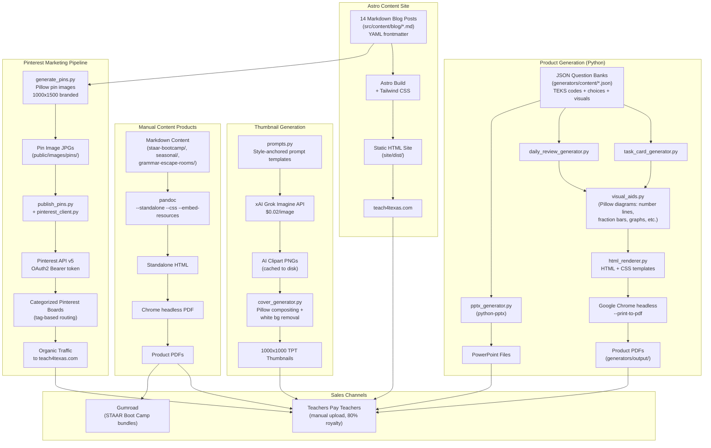

# Teach4Texas -- System Documentation

Disaster recovery and knowledge transfer document. Last updated: 2026-03-24.

---

## 1. What This Project Does

Teach4Texas is an educational content business targeting Texas K-8 teachers. It generates and sells printable/digital classroom resources aligned to Texas STAAR testing standards and TEKS curriculum. The core thesis: help teachers improve STAAR scores, which drives student growth data, which qualifies teachers for TIA (Teacher Incentive Allotment) designation worth $3K-$52K/year in extra pay.

Revenue streams:
- **TPT (Teachers Pay Teachers)** -- primary sales channel, 80% royalty
- **Gumroad** -- STAAR Boot Camp themed packages ($15-$29 each, $59 mega bundle)
- **Content site** (teach4texas.com) -- SEO traffic engine driving email signups and product awareness
- **Pinterest** -- pin-based marketing funneling traffic to the site and TPT store

The project is entirely local (no VPS). All generation runs on macOS.

---

## 2. Architecture

### Content Generation Pipeline

There are two distinct product pipelines:

#### Pipeline A: Programmatic Generator System (`generators/`)

```
JSON content files (generators/content/*.json)
    |
    v
Python generators (task_card_generator.py, daily_review_generator.py)
    |-- Reads JSON questions with TEKS alignment, choices, answers, visual specs
    |-- Generates visual aids via Pillow (visual_aids.py) -- number lines, fraction bars, graphs, etc.
    |-- Embeds visuals as base64 data URIs in HTML
    |-- Assembles HTML using CSS templates (generators/templates/*.css)
    v
HTML documents (generators/output/*.html)
    |
    v  (Chrome headless --print-to-pdf)
PDF products (generators/output/*.pdf)
    |
    v  (optional)
PPTX versions (pptx_generator.py using python-pptx)
```

Thumbnails for these products are generated separately via `cover_generator.py`, which uses Pillow to render 1000x1000 images with optional AI-generated clipart composited on top (via xAI Grok Imagine API).

**Master build command:** `python3 -m generators.build_all` (or pass `tasks`, `daily`, `covers`, `pptx` to build selectively).

#### Pipeline B: Manual Content Products (`tpt-products/`)

Hand-written Markdown content files converted to HTML/PDF:

```
Markdown content (content.md, lesson-plans.md, etc.)
    |
    v  (pandoc --standalone --css=tpt-style.css --embed-resources)
HTML documents
    |
    v  (Chrome headless --print-to-pdf, via html-to-pdf.sh)
PDF products
```

This pipeline covers seasonal products, grammar escape rooms, STAAR bootcamp packages, lesson plans, and professional development guides. Build scripts: `tpt-products/build-pdfs.sh` and `tpt-products/html-to-pdf.sh`.

#### Pipeline C: Excel Templates (`templates/`)

`templates/build_templates.py` generates three `.xlsx` files using openpyxl:
- STAAR_Prep_Tracker.xlsx
- Teacher_Budget_Planner.xlsx
- TIA_Portfolio_Builder.xlsx

**Command:** `python3 templates/build_templates.py`

### Key Dependencies

- **Python**: Pillow (PIL), openpyxl, python-pptx, requests, python-dotenv, PyYAML, numpy
- **System**: Google Chrome (headless PDF rendering), pandoc (Markdown to HTML)
- **Node.js**: Astro framework for the content site
- **APIs**: xAI Grok Imagine (image generation), Pinterest API v5 (pin publishing)

---

## 3. Content Types

### Task Cards (generators/ pipeline)

STAAR-aligned multiple-choice question cards in a 2x3 grid layout per page. Each product contains:
- Cover page (branded, subject-color-coded)
- 32 questions with TEKS references
- Programmatically generated visual aids (number lines, fraction bars, area models, coordinate grids, bar graphs, data tables, geometric shapes, graphic organizers, food webs, force arrow diagrams)
- Answer key table
- Student recording sheet (bubble sheet)

**Products generated:**
| File | Subject | Grade |
|------|---------|-------|
| math_grade3_tasks.json | Math | 3 |
| math_grade4_tasks.json | Math | 4 |
| math_grade5_tasks.json | Math | 5 |
| rla_grade3_tasks.json | RLA | 3 |
| rla_grade4_tasks.json | RLA | 4 |
| rla_grade5_tasks.json | RLA | 5 |
| science_grade5_tasks.json | Science | 5 |
| science_grade8_tasks.json | Science | 8 |

Also generated as PPTX (PowerPoint/Google Slides) versions.

### Daily Reviews / 4-A-Day (generators/ pipeline)

8-week spiraling review packets. Each day has 4 STAAR-aligned questions. Total: 160 questions per product (8 weeks x 5 days x 4 questions).

**Products generated:**
| File | Subject | Grade |
|------|---------|-------|
| math_grade3_daily.json | Math | 3 |
| math_grade4_daily.json | Math | 4 |
| math_grade5_daily.json | Math | 5 |
| rla_grade3_daily.json | RLA | 3 |
| rla_grade4_daily.json | RLA | 4 |
| rla_grade5_daily.json | RLA | 5 |

### STAAR Boot Camp Themed Packages (`staar-bootcamp/`)

Full 5-day themed STAAR prep week packages. Each contains:
- OVERVIEW.md -- quick-start guide
- LESSON-PLANS.md -- day-by-day schedule
- ACTIVITIES.md -- 10+ themed activities
- STUDENT-MATERIALS.md -- printable student resources
- DECORATIONS.md -- classroom/hallway transformation guide
- PARENT-LETTER.md -- communication template

**Premium themes ($29):** STAAR Wars (space/sci-fi), Championship Week (sports), STAARvival (survival/adventure)

**Standard themes ($15):** STAAR Power (superhero), Taco 'Bout STAAR (fiesta/food), STAAR Trek (detective/mystery)

**Mega Bundle:** All 6 themes for $59.

### Seasonal Products (`tpt-products/Uploaded to Teachers Pay Teachers/seasonal/`)

10 calendar-aligned products for Feb-May, $3.99-$7.99 each:
1. Black History Month: Texas Trailblazers Reading Passages
2. Women's History Month STEM Challenge Cards
3. St. Patrick's Day Math Mystery
4. Spring Writing Prompts & Journal
5. Earth Day Science Investigation
6. Cinco de Mayo Cross-Curricular
7. End of Year Memory Book
8. Summer STAAR Review Game Show (Jeopardy)
9. Teacher Appreciation Week Cards
10. Spring Testing Motivation Kit

### Grammar Escape Rooms (`tpt-products/Uploaded to Teachers Pay Teachers/grammar-escape-rooms/`)

4 escape room activities (escape-room-1 through escape-room-4). Each contains student puzzles, teacher guides, and answer keys.

### Professional Development Products

| Product | Path | Price |
|---------|------|-------|
| TIA Quick Reference Card | `tpt-products/Uploaded.../tia-quick-reference/` | FREE |
| TIA Portfolio Guide | `tpt-products/Uploaded.../tia-portfolio-guide/` | $15 |
| TTESS Prep Kit | `tpt-products/Uploaded.../ttess-prep-kit/` | $10 |
| Student Growth Tracker | `tpt-products/Uploaded.../student-growth-tracker/` | $10 |
| STAAR Math Lessons 3-5 | `tpt-products/Uploaded.../staar-math-lessons-3-5/` | $15 |
| STAAR RLA Lessons 3-5 | `tpt-products/Uploaded.../staar-rla-lessons-3-5/` | $12 |
| STAAR Science Lessons | `tpt-products/Uploaded.../staar-science-lessons/` | -- |

### Excel Templates (`templates/`)

Three professional spreadsheet tools:
- **STAAR Prep Tracker** -- student score tracking by TEKS standard
- **Teacher Budget Planner** -- personal finance for teachers
- **TIA Portfolio Builder** -- evidence collection organizer

---

## 4. TPT Products

### Already Uploaded to TPT

Everything under `tpt-products/Uploaded to Teachers Pay Teachers/`:
- `tia-quick-reference/` -- FREE lead magnet
- `tia-portfolio-guide/` -- $15
- `ttess-prep-kit/` -- $10
- `student-growth-tracker/` -- $10 (Excel-based, includes `create-sheet.js` and `build-tracker.py`)
- `staar-math-lessons-3-5/` -- lesson plans PDF
- `staar-rla-lessons-3-5/` -- lesson plans PDF
- `staar-science-lessons/` -- lesson plans PDF
- `grammar-escape-rooms/` -- 4 separate escape rooms
- `seasonal/` -- 10 seasonal products

Each uploaded product directory contains:
- `listing.md` -- TPT listing copy (title, price, description, tags)
- `cover.html` -- HTML cover design for the product
- `preview.pdf` -- preview pages for TPT listing
- The actual product file (PDF, XLSX, etc.)

### New Batch (Not Yet Uploaded)

Under `tpt-products/new-batch/`:
1. `01-figurative-language-fun-pack/` -- figurative language activities (has content.md)
2. `02-staar-reading-passages/` -- reading comprehension passages
3. `03-morning-work-elar-3rd/` -- daily ELAR bell ringers (has content.md)
4. `04-math-task-cards-bundle/` -- math task cards
5. `05-writing-workshop-mini-lessons/` -- writing instruction

Each has: `cover.html`, `cover.pdf`, `thumbnail.png` (Grok-generated), `listing.md`. Some have `content.md` with the actual product content.

**Build new batch:** `./tpt-products/build-new-batch.sh` (converts cover HTML to PDF via Chrome, generates Grok thumbnails).

---

## 5. Site

**Domain:** teach4texas.com
**Framework:** Astro 4.x with Tailwind CSS
**Config:** `astro.config.mjs` -- site URL set to `https://teach4texas.com`, Tailwind integration, GitHub-light Shiki theme for code blocks.

### Structure

```
src/
  pages/
    index.astro        -- Homepage
    about.astro        -- About page
    resources.astro    -- Free resources page
    blog/
      index.astro      -- Blog listing
      [...slug].astro  -- Dynamic blog post routes
  content/
    config.ts          -- Astro content collection schema (title, description, date, author, tags, image, keywords)
    blog/              -- 14 Markdown blog posts
  layouts/
    BaseLayout.astro   -- Base HTML wrapper
    BlogPost.astro     -- Blog post template
  components/
    Header.astro       -- Site header/nav
    Footer.astro       -- Site footer
public/
  images/
    pins/              -- Generated Pinterest pin images (JPG)
    tpt-profile.png    -- TPT store profile picture (600x600)
    tpt-banner.png     -- TPT store banner (1200x320)
  robots.txt
  favicon.svg
  pinterest-f81d6.html -- Pinterest domain verification file
```

### Blog Posts (14 articles)

SEO-targeted content about Texas education topics:
- TIA complete guide, TIA portfolio evidence guide
- TTESS observation tips
- STAAR strategies (math 3rd grade, RLA constructed response, 5th grade science review, test prep week ideas)
- STAAR scores and TIA designation connection
- Texas policy: HB2 teacher pay raise, TEKS updates, certification changes, education freedom accounts (ESA), STAAR replacement tool, Uvalde Strong Act

### Build Commands

```bash
npm run dev       # Local dev server
npm run build     # Production build (output to site/dist/)
npm run preview   # Preview production build
```

---

## 6. AI Image Generation

### xAI Grok Imagine API (`generators/xai_image.py`)

Used for generating cartoon clipart composited onto TPT product thumbnails.

- **API endpoint:** `https://api.x.ai/v1/images/generations`
- **Models:** `grok-imagine-image` (standard, $0.02/image), `grok-imagine-image-pro` ($0.07/image)
- **Auth:** Bearer token via `XAI_API_KEY` in `.env`
- **Caching:** Images saved to `generators/output/ai-images/thumbnails/` and skipped if already present
- **Style:** All prompts include a consistent style anchor for bold-outlined, flat-color cartoon clipart on white backgrounds

### Prompt System (`generators/prompts.py`)

Centralized prompt templates organized by category:
- **SUBJECT_ICONS** -- math/rla/science item collections
- **COVER_CHARACTERS** -- diverse kids studying
- **SCENES** -- classroom and Texas-themed illustrations
- **PRODUCT_TYPE_ICONS** -- task cards, daily planners
- **Thumbnail prompts** -- subject + product type combinations via `get_thumbnail_prompt()`

All prompts append a `STYLE_ANCHOR` for visual consistency and subject-specific color hints matching the brand palette.

### Standalone Thumbnail Generator (`tpt-products/generate-thumbnails.py`)

Separate from the generators/ system. Uses Grok Imagine API directly (via urllib, no SDK) to generate colorful TPT-style thumbnail images for the new-batch products. Reads API key from environment or falls back to `x-policy-project/scheduler/config.py`.

### Other Image Scripts

- `generate_profile_pic.py` -- creates 600x600 TPT profile picture (Pillow, navy background with "T4T" monogram)
- `generate_tpt_banner.py` -- creates 1200x320 TPT store banner (Pillow, navy with burnt orange accents)

---

## 7. Pinterest Integration

### Pin Image Generation (`generate_pins.py`)

Reads blog post frontmatter (YAML) from `src/content/blog/`, generates branded 1000x1500 Pinterest pin images:
- Navy-to-white gradient background
- Subject badge derived from post tags (e.g., "STAAR MATH", "TIA GUIDE")
- Title text, subtitle, "Teach4Texas" branding, call-to-action bar
- Output: `public/images/pins/pin-{slug}.jpg`

**Tag-to-badge mapping** determines badge text based on post tags (most specific match wins).

Also supports standalone pins not tied to blog posts (e.g., "Free Resources" pin).

### Pinterest Publishing (`pinterest/publish_pins.py`)

Automated pin publishing to Pinterest boards via API v5:

- **Auth:** OAuth2 flow via `pinterest_auth.py` -- one-time browser-based authorization, refresh token stored in `.env`
- **Client:** `pinterest_client.py` -- board listing, board ID lookup, pin creation with rate limiting
- **Board mapping:** Posts are routed to boards based on tags (e.g., STAAR math posts go to "STAAR Math Resources" and "STAAR Test Prep Activities" boards)
- **State tracking:** `pinterest_state.json` tracks which posts have been pinned to avoid duplicates
- **Hashtags:** Auto-generated from post tags, combined with common hashtags (#TexasTeacher, #teach4texas, #Texaseducation)

**Commands:**
```bash
cd pinterest
python3 publish_pins.py                  # Publish all unpublished
python3 publish_pins.py --dry-run        # Preview only
python3 publish_pins.py --post <slug>    # Publish specific post
python3 publish_pins.py --list-boards    # Show board IDs
python3 publish_pins.py --status         # Show publish status
python3 publish_pins.py --auth           # One-time OAuth setup
```

### Pinterest Board Strategy

Boards configured (see `PINTEREST-SETUP.md` for full descriptions):
- STAAR Test Prep Strategies / STAAR Test Prep Activities
- STAAR Math Resources
- STAAR RLA & Writing
- STAAR Science Activities
- TIA Designation & Teacher Pay
- T-TESS Tips & Observation Prep
- Free Teacher Resources & Printables

---

## 8. Gumroad Integration

Gumroad is used for selling STAAR Boot Camp themed packages. There is no API integration -- setup is manual.

Full copy-paste listing instructions are in `GUMROAD-SETUP.md`, covering:
- Account profile configuration (display name, bio, payment setup)
- 7 product listings with exact field values:
  1. STAAR Wars Boot Camp (Premium) -- $29
  2. Championship Week Boot Camp (Premium) -- $29
  3. STAARvival Boot Camp (Premium) -- $29
  4. STAAR Power Boot Camp (Standard) -- $15
  5. Taco 'Bout STAAR Boot Camp (Standard) -- $15
  6. STAAR Trek Boot Camp (Standard) -- $15
  7. STAAR Boot Camp Mega Bundle -- $59
- Each listing includes: name, price, category, tags, full description, FAQ, and call-to-action text

The actual product files are the PDFs generated from `staar-bootcamp/` Markdown via `build-pdfs.sh`.

---

## 9. Key Files

### Root

| File | Purpose |
|------|---------|
| `MASTER-PLAN.md` | Business strategy, revenue targets, phase timeline |
| `GUMROAD-SETUP.md` | Copy-paste Gumroad product listing instructions |
| `PINTEREST-SETUP.md` | Copy-paste Pinterest profile/board setup instructions |
| `.env` | API keys (XAI_API_KEY, Pinterest OAuth credentials) |
| `generate_pins.py` | Generate Pinterest pin images from blog frontmatter |
| `generate_profile_pic.py` | Generate TPT profile picture (600x600) |
| `generate_tpt_banner.py` | Generate TPT store banner (1200x320) |
| `package.json` | Astro site dependencies and scripts |
| `astro.config.mjs` | Astro framework configuration |
| `tailwind.config.mjs` | Tailwind CSS configuration |

### `generators/`

| File | Purpose |
|------|---------|
| `build_all.py` | Master build script -- generates all products |
| `brand.py` | Shared brand constants (colors, fonts, paths), text wrapping utilities |
| `html_renderer.py` | HTML assembly + Chrome headless PDF conversion |
| `task_card_generator.py` | Task card PDF generation (cover + 2x3 card grid + answer key + recording sheet) |
| `daily_review_generator.py` | 4-A-Day daily review PDF generation (cover + 40 day pages + answer key) |
| `cover_generator.py` | 1000x1000 TPT thumbnail generation with AI clipart compositing |
| `pptx_generator.py` | PowerPoint version generation (python-pptx) |
| `visual_aids.py` | Pillow-based diagram generators (number lines, fraction bars, area models, coordinate grids, bar graphs, data tables, geometric shapes, graphic organizers, food webs, force arrows) |
| `xai_image.py` | xAI Grok Imagine API client (generate, save, cache) |
| `prompts.py` | Centralized AI image prompt templates with style anchor |
| `test_xai_images.py` | Test harness for AI image generation QA |
| `content/` | 14 JSON files defining task card and daily review questions |
| `templates/` | 3 CSS files (task_card.css, daily_review.css, cover.css) |
| `output/` | All generated files (PDFs, HTML, PPTX, thumbnails, AI images) |

### `tpt-products/`

| File | Purpose |
|------|---------|
| `build-pdfs.sh` | Build PDFs for seasonal, escape rooms, and bootcamp products (pandoc + Chrome) |
| `build-new-batch.sh` | Build cover PDFs + Grok thumbnails for new-batch products |
| `html-to-pdf.sh` | Chrome headless HTML-to-PDF conversion for all product types |
| `generate-thumbnails.py` | Grok Imagine API thumbnail generator for new-batch products |
| `tpt-style.css` | Shared CSS for pandoc-generated HTML products |
| `Uploaded to Teachers Pay Teachers/` | Products already listed on TPT |
| `new-batch/` | Products in progress, not yet uploaded |

### `staar-bootcamp/`

| Directory | Purpose |
|-----------|---------|
| `premium/staar-wars/` | Space/sci-fi themed 5-day STAAR prep package |
| `premium/championship-week/` | Sports themed package |
| `premium/staarvival/` | Survival/adventure themed package |
| `standard/staar-power/` | Superhero themed package |
| `standard/taco-bout-staar/` | Fiesta/food themed package |
| `standard/staar-trek-mystery/` | Detective/mystery themed package |
| `GUMROAD-LISTINGS.md` | Individual Gumroad listing copy for each theme |
| `MEGA-BUNDLE-LISTING.md` | Mega bundle listing copy |

### `templates/`

| File | Purpose |
|------|---------|
| `build_templates.py` | Generates 3 Excel templates (openpyxl) |
| `student-growth-tracker-spec.md` | Specification for the growth tracker spreadsheet |
| `tia-portfolio-guide.md` | TIA portfolio guide content |

### `pinterest/`

| File | Purpose |
|------|---------|
| `pinterest_auth.py` | OAuth2 flow (one-time setup + token refresh) |
| `pinterest_client.py` | Pinterest API v5 client (boards, pins) |
| `publish_pins.py` | Publish blog pins to Pinterest boards |
| `pinterest_state.json` | Tracks which posts have been pinned |

### `marketing/`

| File | Purpose |
|------|---------|
| `brand-guide.md` | Color palette, fonts, logo concept, taglines |
| `pinterest-strategy.md` | Pinterest growth strategy |
| `facebook-groups.md` | Texas teacher Facebook group outreach plan |
| `social-media-posts.md` | Pre-written social media content |
| `video-content-ideas.md` | YouTube/video content ideas |
| `logo.html` | HTML-based logo mockup |

### `src/` (Astro site)

| File | Purpose |
|------|---------|
| `pages/index.astro` | Homepage |
| `pages/about.astro` | About page |
| `pages/resources.astro` | Free resources listing |
| `pages/blog/index.astro` | Blog listing page |
| `pages/blog/[...slug].astro` | Dynamic blog post route |
| `content/config.ts` | Blog collection schema (title, description, date, author, tags, image, keywords) |
| `content/blog/*.md` | 14 SEO blog posts |
| `layouts/BaseLayout.astro` | Base HTML layout |
| `layouts/BlogPost.astro` | Blog post layout |
| `components/Header.astro` | Site header |
| `components/Footer.astro` | Site footer |

---

## 10. How to Rebuild

### Prerequisites

```bash
# Python packages
pip3 install Pillow openpyxl python-pptx requests python-dotenv pyyaml numpy

# System tools
# - Google Chrome (for headless PDF rendering)
# - pandoc (for Markdown to HTML conversion)
# - Node.js + npm

# API keys in .env (project root)
# XAI_API_KEY=xai-...           (for AI thumbnail generation)
# PINTEREST_APP_ID=...          (for Pinterest publishing)
# PINTEREST_APP_SECRET=...
# PINTEREST_REFRESH_TOKEN=...
```

### Step 1: Generate Task Cards and Daily Reviews

```bash
cd ~/Claude/teach4texas

# Generate everything (task cards, daily reviews, covers/thumbnails, PPTX)
python3 -m generators.build_all

# Or selectively:
python3 -m generators.build_all tasks     # Task card PDFs only
python3 -m generators.build_all daily     # Daily review PDFs only
python3 -m generators.build_all covers    # Thumbnails with AI clipart
python3 -m generators.build_all pptx      # PowerPoint versions
```

Output goes to `generators/output/`. This produces 8 task card PDFs, 6 daily review PDFs, 8 PPTX files, and 14 thumbnails.

### Step 2: Generate Excel Templates

```bash
python3 templates/build_templates.py
```

Output: 3 `.xlsx` files in `templates/`.

### Step 3: Build Manual Content Products (Seasonal, Escape Rooms, Bootcamp)

```bash
# Build HTML from Markdown
./tpt-products/build-pdfs.sh

# Convert HTML to PDF
./tpt-products/html-to-pdf.sh
```

Note: `build-pdfs.sh` references old paths (`~/.openclaw/workspace/projects/teacher-niche/`). If those paths are stale, update the path variables at the top of the script to point to the current `~/Claude/teach4texas/` tree.

### Step 4: Build New Batch Products

```bash
./tpt-products/build-new-batch.sh
```

Generates cover PDFs and Grok thumbnail images for the 5 new-batch products.

### Step 5: Generate Branding Assets

```bash
python3 generate_profile_pic.py    # TPT profile picture -> public/images/tpt-profile.png
python3 generate_tpt_banner.py     # TPT banner -> public/images/tpt-banner.png
```

### Step 6: Generate Pinterest Pins

```bash
python3 generate_pins.py           # Generate pin images for all blog posts
python3 generate_pins.py --all     # Regenerate all (even existing)
```

Output: `public/images/pins/pin-*.jpg`

### Step 7: Build the Astro Site

```bash
npm install
npm run build
```

Output: `site/dist/` (static HTML, ready for deployment to Vercel or similar).

### Step 8: Publish Pins to Pinterest

```bash
cd pinterest
python3 publish_pins.py --auth       # One-time OAuth setup (opens browser)
python3 publish_pins.py --dry-run    # Preview what will be published
python3 publish_pins.py              # Publish all unpublished pins
```

### Step 9: Upload to TPT

Manual process. For each product:
1. Open the `listing.md` file for TPT listing copy (title, description, price, tags)
2. Upload the PDF/XLSX product file
3. Upload the cover image / thumbnail
4. Upload the preview PDF
5. Paste listing copy into TPT fields

### Full Rebuild Order (from scratch)

```bash
cd ~/Claude/teach4texas

# 1. Python products
python3 -m generators.build_all
python3 templates/build_templates.py

# 2. Manual content products
./tpt-products/build-pdfs.sh
./tpt-products/html-to-pdf.sh

# 3. New batch
./tpt-products/build-new-batch.sh

# 4. Branding
python3 generate_profile_pic.py
python3 generate_tpt_banner.py

# 5. Pinterest pin images
python3 generate_pins.py

# 6. Astro site
npm install && npm run build

# 7. Pinterest publishing (requires OAuth setup)
cd pinterest && python3 publish_pins.py
```

---

## Brand Identity

- **Primary Navy:** #1B365D
- **Accent Burnt Orange:** #BF5700 (math accent)
- **Success Green:** #548235 (RLA accent)
- **Gold:** #BF8700 (science accent)
- **White:** #FFFFFF
- **Light Gray:** #F8F9FA
- **Store name:** Teach4Texas
- **Tagline:** "Professional Resources for Texas Educators"
- **Author byline:** "Lone Star Educator"
- **Site:** https://teach4texas.com

---

## Environment Variables

File: `.env` (project root, gitignored)

```env
# Pinterest OAuth2 — for pinterest/ publishing pipeline
PINTEREST_APP_ID=<your-pinterest-developer-app-id>
PINTEREST_APP_SECRET=<your-pinterest-developer-app-secret>
PINTEREST_REFRESH_TOKEN=<auto-populated-by-pinterest_auth.py-oauth-flow>

# xAI Grok Image Generation — for AI clipart on thumbnails/covers
XAI_API_KEY=<your-xai-api-key>
```

No other environment variables are used. The Astro site, Python generators, and build scripts all use hardcoded paths and embedded configuration.

---

## Data Flow End-to-End



---

## Critical Value-Add Components

1. **Automated TEKS-Aligned Content Pipeline:** JSON question banks with TEKS standard codes feed into multiple output formats (PDF task cards, daily review packets, PPTX) through a single `python3 -m generators.build_all` command. Adding a new grade/subject means creating one JSON file and updating the product catalog -- all visual formatting, answer keys, and recording sheets are generated automatically.

2. **Visual Aid Generator Library** (`visual_aids.py`): Ten Pillow-based diagram generators (number lines, fraction bars, area models, coordinate grids, bar graphs, data tables, geometric shapes, graphic organizers, food webs, force arrows) render at 2x resolution with anti-aliasing. These embed directly as base64 data URIs in HTML-to-PDF products, making the PDFs self-contained with no external image dependencies.

3. **AI Clipart Compositing with Caching:** xAI Grok generates subject-specific cartoon clipart using a consistent style anchor for visual brand coherence. `cover_generator.py` automatically removes white backgrounds via numpy thresholding and composites clipart onto branded thumbnails. Images are cached by product slug, so subsequent builds cost nothing.

4. **Pinterest Auto-Publishing with Smart Board Categorization:** Blog post tags automatically map to Pinterest boards through a specificity-ranked matching system (e.g., `{staar, math}` -> "STAAR Math Resources" + "STAAR Test Prep Activities"). `pinterest_state.json` prevents duplicate pins. Hashtag builder assembles tag-specific + common hashtags respecting Pinterest's character limits.

5. **TIA + STAAR Content Moat:** The blog content uniquely connects STAAR test prep to TIA teacher pay designation ($3K-$32K/year) -- a connection no other teacher resource site makes explicitly. This is the core SEO differentiation strategy.

6. **Multi-Format Product Generation from Single Source:** One JSON question bank generates PDF (task cards in 2x3 grid), daily review packets (4-A-Day format), PPTX slides, thumbnails, and answer keys. The same content can be sold multiple times in different formats.

---

## Common Failure Modes & Known Technical Debt

### Failure Modes

1. **Stale paths in `build-pdfs.sh`:** References `~/.openclaw/workspace/projects/teacher-niche/` which is an older project location. The `tpt-style.css`, seasonal products, and grammar escape room paths are broken. Must update variables at top of script to `~/Claude/teach4texas/`.

2. **Chrome headless PDF rendering fails silently:** `html_renderer.py` requires Google Chrome at the exact macOS path `/Applications/Google Chrome.app/Contents/MacOS/Google Chrome`. If Chrome is missing or at a different path, PDFs are not generated but the script continues without error (just prints "FAILED"). No fallback renderer (wkhtmltopdf, weasyprint, etc.).

3. **macOS font dependency:** `brand.py` and all Pillow generators try 5 macOS-specific font paths (Helvetica.ttc, SFNSDisplay.ttf, etc.). On Linux/Windows, falls back to Pillow's default bitmap font which produces ugly, unprofessional output. The same font-loading code is duplicated in `generate_pins.py` instead of importing from `brand.py`.

4. **Pinterest OAuth token expiry:** Refresh tokens expire periodically. `publish_pins.py` will fail with 401. Recovery: re-run `python3 pinterest_auth.py` interactively (requires browser on localhost).

5. **xAI API failures have no retry logic:** Image generation has a 120-second timeout but no exponential backoff or retry. A failed image leaves no cached file, so re-running `build_all` retries, but a persistent API outage blocks all thumbnail generation.

6. **Content JSON has no validation:** Malformed JSON (missing keys, wrong types) will crash generators with unhelpful Python tracebacks. No schema validation layer exists.

7. **`generate_pins.py` hardcodes paths to `site/` subdirectory:** `BLOG_DIR` points to `site/src/content/blog` and `OUTPUT_DIR` to `site/public/images/pins`. If the active blog content is in root `src/content/blog/`, pin generation may miss posts or output to the wrong location.

### Technical Debt

1. **Duplicate Astro site:** Both root `src/` and `site/src/` contain Astro site code with overlapping blog content. Root `src/` appears active for development, but `site/` has its own `node_modules` and built `dist/`. Should be consolidated to one location.

2. **Duplicate `package.json`:** Root and `site/` both have nearly identical Astro + Tailwind configurations.

3. **No root-level `requirements.txt`:** Python dependencies are scattered -- `pinterest/requirements.txt` covers only the Pinterest pipeline. The generators need `Pillow`, `numpy`, `python-pptx`, `openpyxl`, `requests`, `python-dotenv`, `pyyaml` but these are not documented in a single requirements file.

4. **No `.env.example`:** New developers must reverse-engineer required environment variables from reading source code.

5. **Brand constants duplicated:** `generate_pins.py` re-declares `NAVY`, `BURNT`, `WHITE`, `FONT_PATHS`, and `get_font()` instead of importing from `generators/brand.py`.

6. **No automated tests** beyond `test_xai_images.py` (visual QA only). No unit tests for question rendering, visual aid generation, or pin image layout.

7. **Sitemap integration not wired:** `@astrojs/sitemap` is in `package.json` dependencies but not included in `astro.config.mjs` integrations array. The site will not generate a sitemap for SEO.

8. **AI image costs are unbounded:** No budget cap on xAI API spending. Running `build_all covers` regenerates all thumbnails that aren't cached. If cache is cleared, full regeneration costs ~$0.28 (14 images x $0.02).

9. **Content JSON source of truth reminder:** Task cards and daily reviews are driven entirely by `generators/content/*.json`. Never edit generated HTML/PDF directly -- changes will be overwritten on next build.
